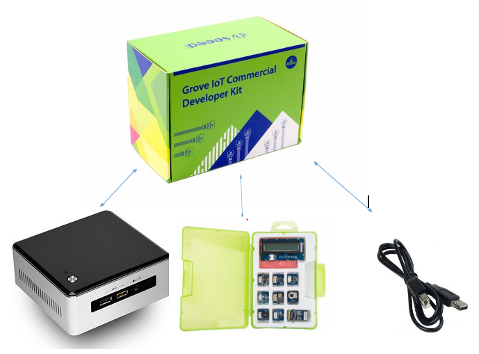
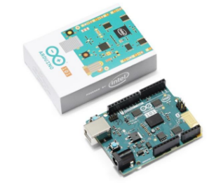

# Setup and Connect to your Intel* NUC to the Arduino Create Environment

## Lab Objectives
This lab walks through the setup process for using an Intel* NUC, Arduino 101*, and a Grove sensor kit are ready for IoT development with the Arduino Create Environment.

By the end of this module, you should be able to:
1. [Setup the Hardware](nuc-setup-hardware.md)
2. [Install the Arduino Create Agent on Your Development Computer](setup-arduino-create-agent.md)
3. [Register Your Up2 Board as a Device on Arduino Create](nuc-register-device.md)

