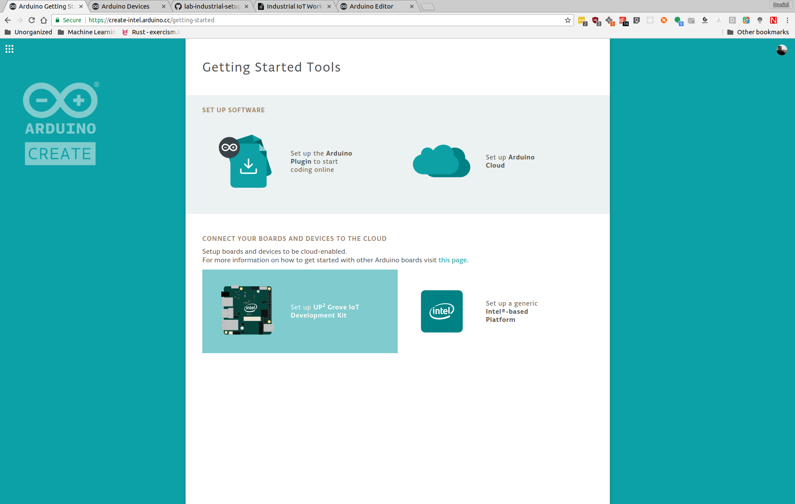
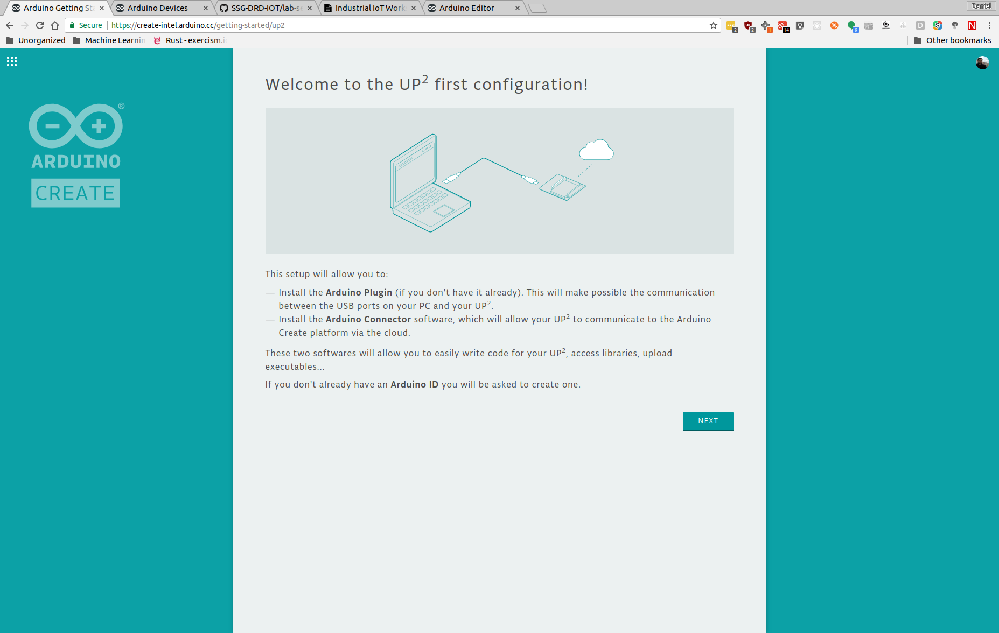
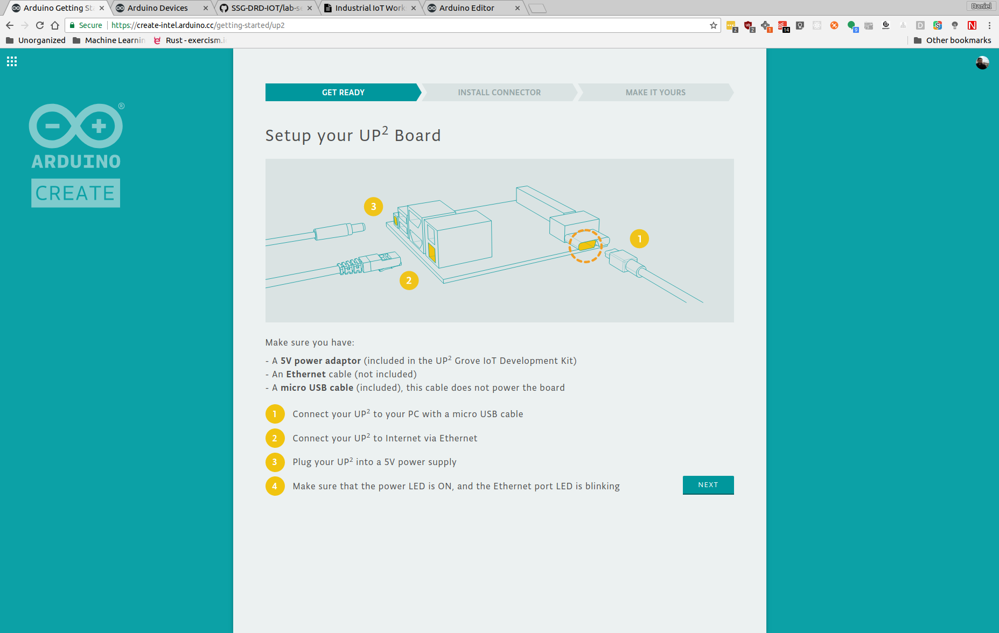
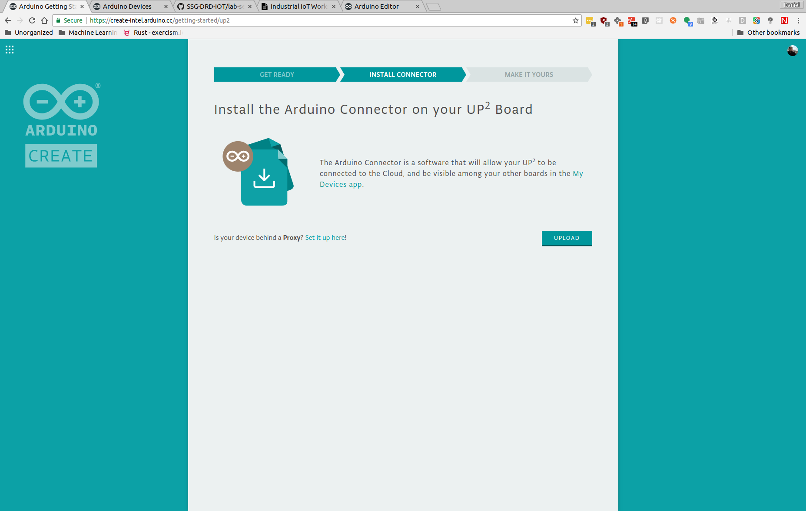
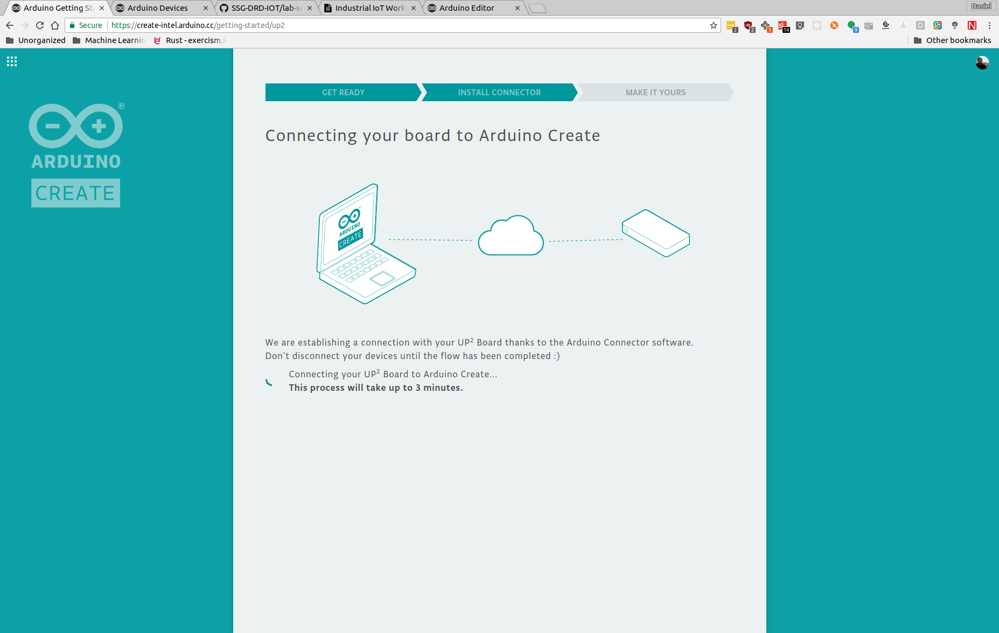
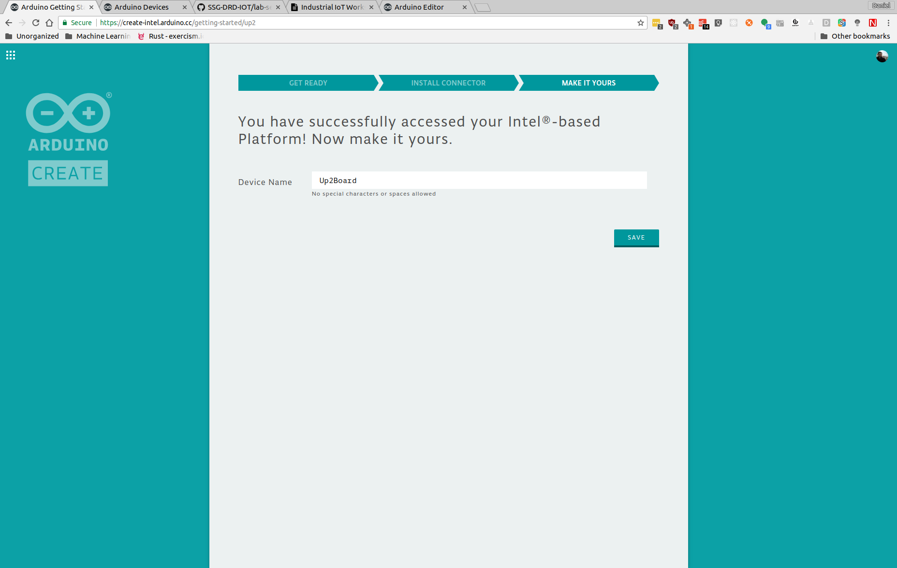
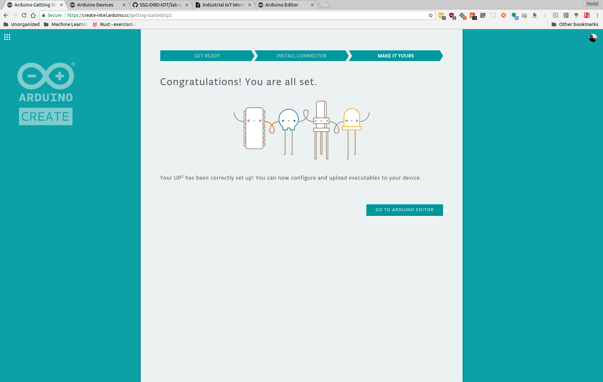

[Workshop Agenda](https://github.com/SSG-DRD-IOT/Industrial-IoT-Workshop) > [Intel* NUC Getting Started Guide](https://github.com/SSG-DRD-IOT/lab-nuci7-setup) > [Register Device](nuc-register-device.md)
# Register Intel* NUC Board with Arduino Create

Follow the steps online to register your Up2 Board.

