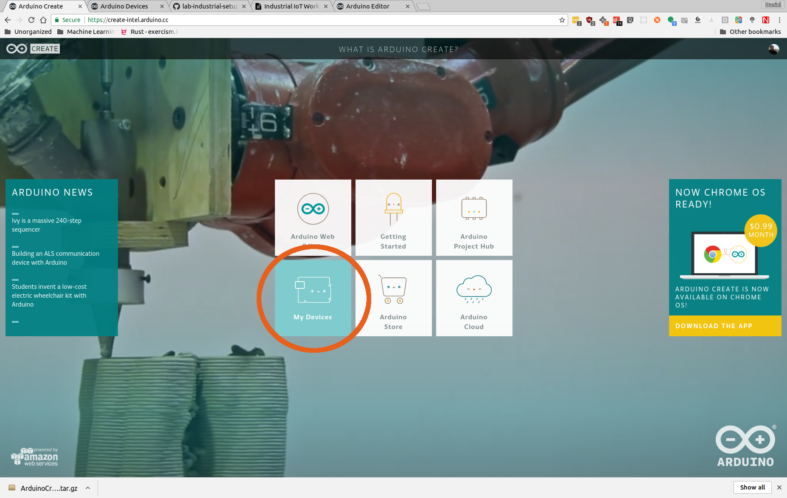
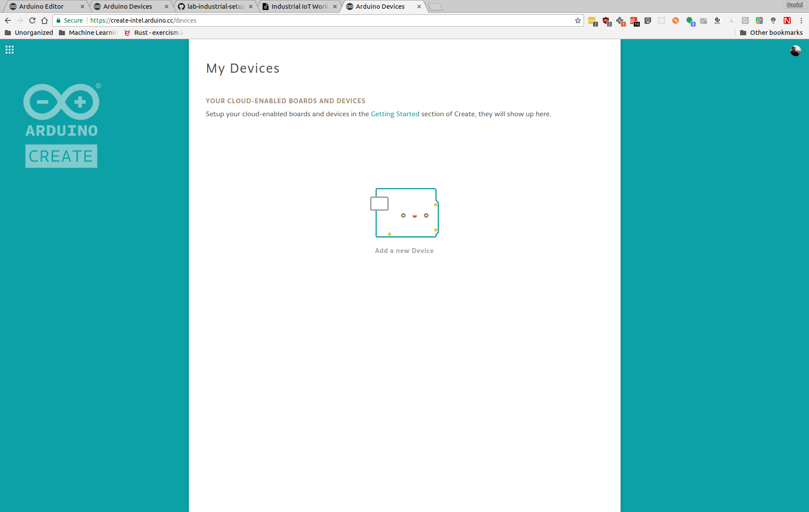
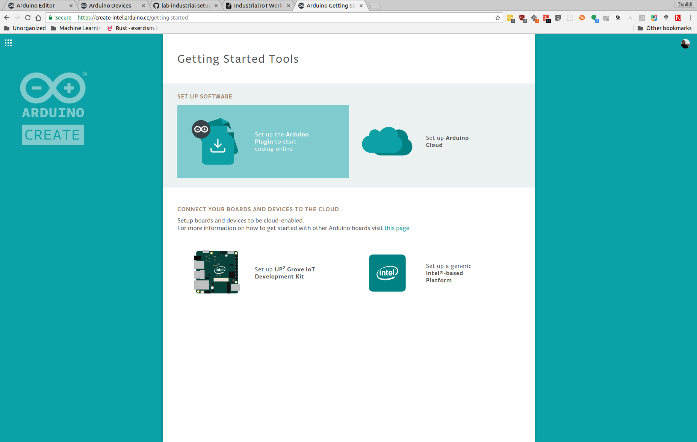
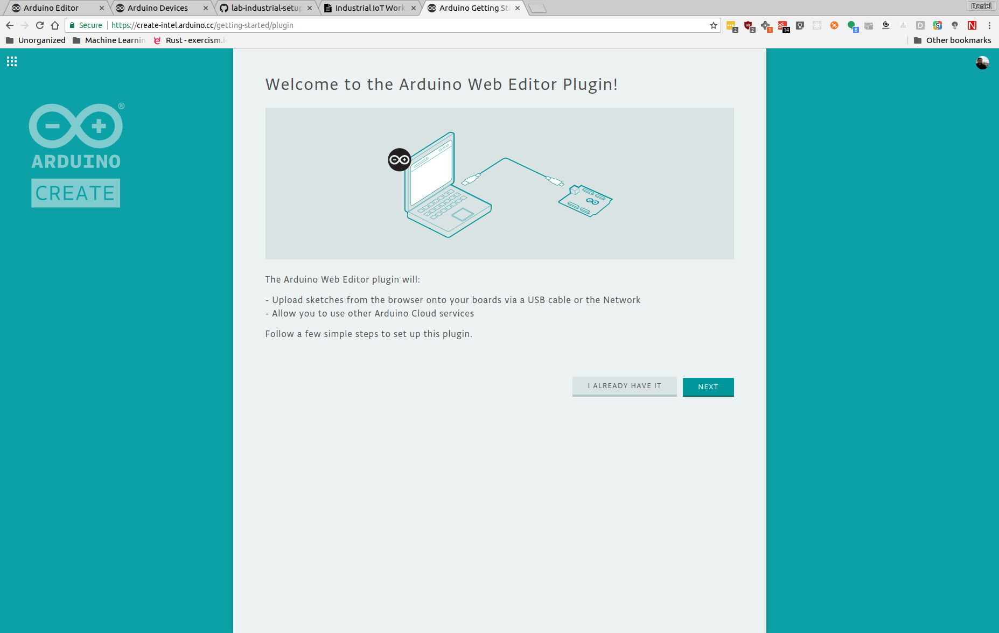
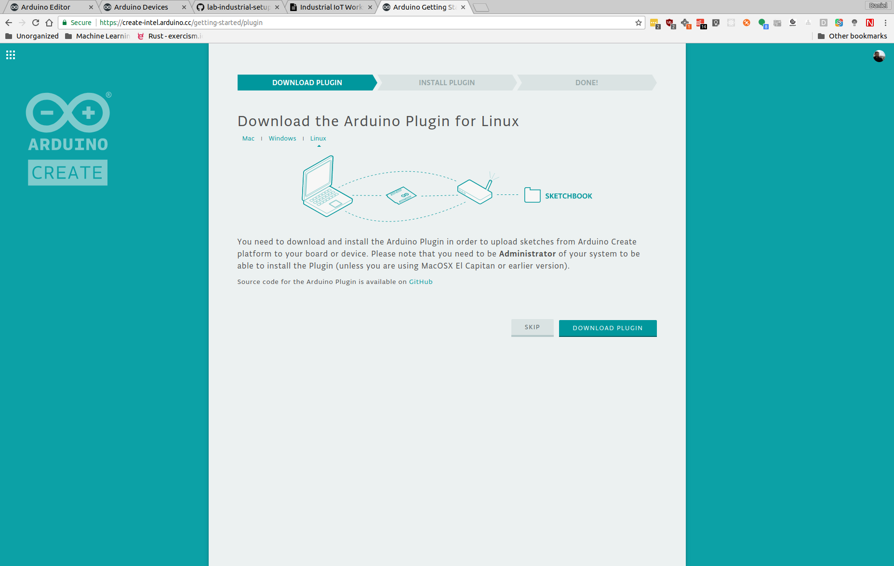

[Workshop Agenda](https://github.com/SSG-DRD-IOT/Industrial-IoT-Workshop) > [Intel* NUC Getting Started Guide](https://github.com/SSG-DRD-IOT/lab-nuci7-setup) > [Installing the Arduino Create Agent](setup-arduino-create-agent.md)

# Installing the Arduino Create Agent

The Arduino Create Agent is a small service that connects your development computer to your prototyping board. Even though the development environment is a web application in the cloud, you still must have the prototyping board and your development computer on the same network.

## Installation Steps
To install the Arduino Create Agent, you must first go to [http://create.arduino.cc/](http://create.arduino.cc/) and click on the **My Devices** link.

 Click on **Add a new Device**.

 Select the **Next** button.

 Select the **Set up the Arduino Plugin to start coding online** link.

 Note:  If you don’t already have an Arduino Create account, follow the onscreen instructions to sign up. You'll need to activate your account and log into the site using your new account.

 The Arduino Create website will detect your OS and begin downloading the Os specific Arduino Create Agent.

Install the Agent and you will see if appear in the system tray of UI menu of your operating system.

## Connecting over IP Networking
After you install the Arduino Create Agent, it will use the USB cable that you connected from the device to your development computer to login to your device, get the IP address and complete the registration process with the Arduino Create environment.

## Name Your Computer
Lastly, you will be asked to name Your device.

## Now You Can Begin Coding
